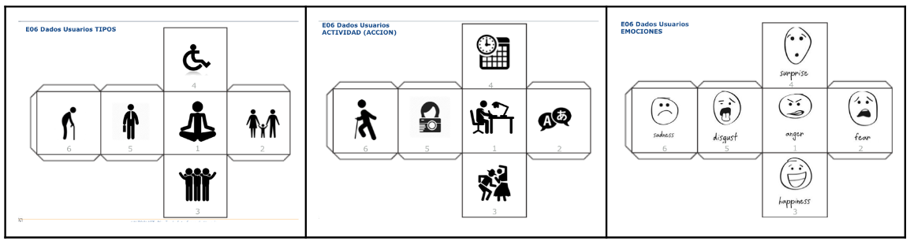
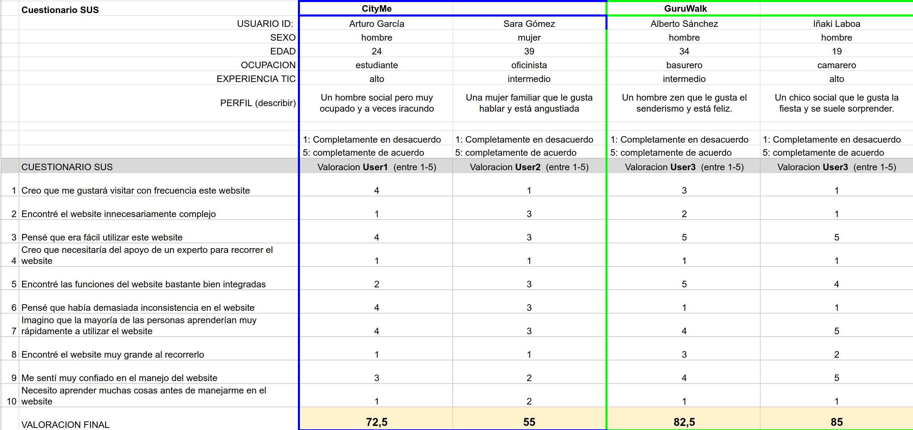

# Caso de estudio: CityMe

## Objetivos

Queremos evaluar el novedoso modelo de tours virtuales sobre el cuál se basa la aplicación CityMe para ver si mejora la experiencia de usuario y la usabilidad de las aplicaciones que ofrecen servicios de free tour.

## Metodología

Primero vamos a realizar un análisis más técnico empezando con un estudio de los servicios que ofrece CityMe en comparación a los que ofrece GuruWalk, como ejemplo de propuesta de free tours, y luego procederemos a hacer una revisión de la usabilidad en las dos aplicaciones basándonos en varios conceptos relevantes.

Una vez se hayan comparado los dos sites nos pondremos en la piel del usuario para hacer un análisis subjetivo mediante cuestionarios SUS. Cabe destacar que estos usuarios se crearán de manera aleatoria y tendrán varios atributos que modelarán su comportamiento y actitud frente a las dos propuestas.

Por último pondremos todo en común y extraremos conclusiones acerca de la hipótesis planteada.

## Análisis técnico

### Comparación de las propuestas de valor

A continuación se muestra una tabla con la comparación de los servicios ofrecidos en las dos propuestas de valor:

|  | [CityMe](https://cityme.eu/) | [GuruWalk](https://www.guruwalk.com/) |
| ----- | ----- | ----- |
| Cantidad de sitios | Pocos, solo hay cinco ciudades | Muchos, está lleno de tours en lugares distintos |
| Valoración de los tours por parte de los usuarios | No | Sí |
| Idiomas disponibles | Tres | Cuatro |
| Buscador de tours | No | Sí | 
| Libertad | Completa libertad de visita | No mucha, es un sistema más rígido |
| Gratuito | Sí pero con ciertas restricciones | En absoluto |
| Permite al usuario convertirse en guía | No | Sí |
| Flexibilidad horaria | Completa | Poca, los tours están programados |
| Diferentes guías y puntos de vista | No, solo hay un "guía" para cada ciudad | Enorme variedad de tours y guías a través de los mismos sitios |
| Landing page funcional | Solo para información, te lleva a descargar la app | Permite visualizar toda la información acerca de los tours y la aplicación así como reservar |

Como podemos observar hay mucha diferencia entre los servicios y funcionalidades ofrecidos por cada propuesta de valor. CityMe parece que a simple viste ofrece unos servicios más restringidos, sin embargo, hay que tener en cuenta que su valor se basa en que se tiene completa libertad de movimiento y en no depender de ningún guía. Debido a esto, muchas cosas que tiene GuruWalk no pueden ser ofrecidas de igual manera.

### Revisión de la usabilidad

A continuación, usando los cuestionarios que hay subidos con el nombre de **revision usabilidad "nombreapp".xlsx**, se han obtenido los siguientes resultados:

- [CityMe](https://github.com/joseptnl/practica_final_diu/blob/main/revision%20usabilidad%20cityme.xlsx)

> Valoración de usabilidad:
> 
> 74 / 100

- [GuruWalk](https://github.com/joseptnl/practica_final_diu/blob/main/revision%20usabilidad%20guruwalk.xlsx)

> Valoración de usabilidad:
> 
> 93 / 100

## Análisis subjetivo

### Los usuarios

Para poder crear los usuarios de manera aleatoria se han usado los siguientes dados, cada uno define un atributo en concreto de la personalidad y el transfondo de los personajes:

Se generan 3 números aleatorios para generar cada uno de los dos perfiles. Estos han quedan como sigue:

| id | Sexo / edad | Ocupación | Experiencia internet | Perfil cubierto |
|----|------|--------------|-------------|-----|
| Arturo García | Hombre / 24 | Estudiante | Alto | Un hombre social pero muy ocupado y a veces iracundo. |
| Sara Gómez | Mujer / 39 | Oficinista | Intermedio | Una mujer familiar que le gusta hablar y está angustiada. |
| Alberto Sánchez | Hombre / 34 | Basurero | Intermedio | Una hombre zen que que le gusta el senderismo y está feliz. |
| Iñaki Laboa | Hombre / 19 | Camarero | Alto | Una chico social que le gusta la fiesta y se suele sorprender. |

Cabe destacar también la experiencia de estos usuarios en el uso de las distintas plataformas:

| Plataforma | Arturo García | Sara Gómez | Alberto Sánchez | Iñaki Laboa |
|------|------|------|------|------|
| Windows | 5 / 5 | 4 / 5 | 3 / 5 | 1 / 5 |
| Mac | 0 / 5 | 0 / 5 | 0 / 5 | 5 / 5 |
| Linux | 0 / 5 | 0 / 5 | 0 / 5 | 0 / 5 |
| Iphone | 5 / 5 | 1 / 5 | 0 / 5 | 5 / 5 |

### Valoración de la usabilida basada en su UX

A continuación se muestran los resultados del cuestionario sus. Los primeros dos usuarios se han usado para evaluar la aplicación de CityMe y los otros dos para la aplicación de GuruWalk:

Como podemos ver los usuarios le han asignado una puntuación promedia de **63,75** a CityMe y de **83,875** a GuruWalk.

## Conclusiones

En conclusión podemos ver como claramente se ha valorado la aplicación de GuruWalk por encima de la de CityMe. Tanto los resultados del análisis más técnico como los del estudio subjetivo corroboran esta valoración con valores relativamente proporcionales entre los dos. Cabe destacar que las cifras obtenidos en el test de los usuarios son relativamente menores ya que los usuarios tienden a realizar evaluaciones a la baja sobretodo si se basan en sensaciones y emociones.

Aún así, tampoco se puede dar una respuesta rotunda acerca de sí los modelos free tour son mejores que el que propone CityMe, ya que si bien los datos respaldan la decisión hay que tener en cuenta que la segunda es una propuesta mucho más joven y por lo tanto menos desarrollada. Podría ser que en un futuro se cambiaran las tornas.

